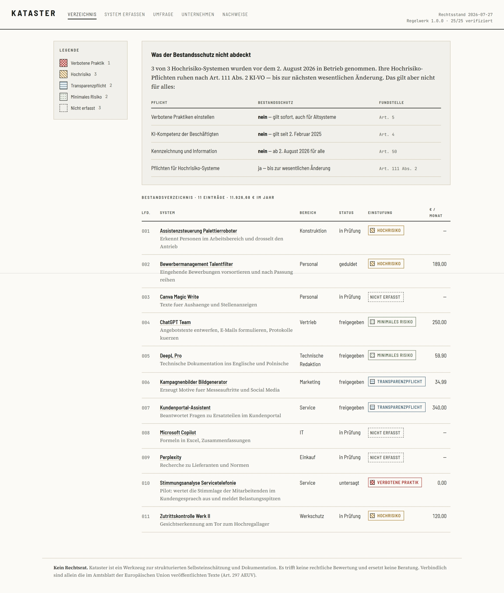
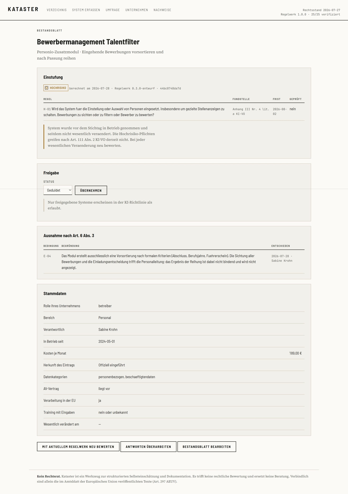

# Kataster

Ein lokales Werkzeug, mit dem kleine und mittlere Unternehmen erfassen, welche
KI-Systeme bei ihnen im Einsatz sind, welche Pflichten daraus folgen und was
davon dokumentiert werden muss.

Läuft auf dem eigenen Rechner. Keine Registrierung, kein Konto, keine Cloud.
Beim Seitenaufbau geht keine einzige Anfrage an einen fremden Server — die
Schriften liegen lokal, das Nachweis-Dossier ist eine eigenständige Datei ohne
externe Verweise.



---

## Was es tut

**Erfassen.** Ein geführter Fragebogen ordnet jedes System einer von vier
Risikoklassen zu: verbotene Praktik, Hochrisiko, Transparenzpflicht oder
minimales Risiko. Eine Vorauswahl des Einsatzbereichs blendet aus, was nicht
einschlägig sein kann — ein Büro-Textassistent braucht zehn Fragen, ein
Bewerbermanagement siebzehn.

**Nachvollziehen.** Jede Einstufung lässt sich auf eine benannte Regel und
deren Fundstelle im amtlichen Text zurückführen. Es gibt keine
KI-gestützte Auslegung: Die Zuordnung ist regelbasiert und deterministisch.
Einstufungen werden historisiert, nie überschrieben — wenn sich die Rechtslage
ändert, bleibt nachvollziehbar, was zu welchem Zeitpunkt galt.

**Vollständig werden.** Ein Verzeichnis, das nur die offiziell eingeführten
Systeme kennt, täuscht Vollständigkeit vor. Kataster erzeugt einen anonymen
Fragebogen für die Beschäftigten und liest die Rückmeldungen ein — gebündelt
nach Werkzeug, mit Schreibvarianten, zur Prüfung vor der Übernahme.

**Belegen.** Vier Dokumente aus dem erfassten Bestand: Bestandsverzeichnis als
Tabelle, Entwurf einer KI-Richtlinie, rollenspezifische Schulungsmatrix und ein
Nachweis-Dossier mit Zeitstempel, Rechtsstand und Prüfsumme.



---

## Loslegen

```bash
git clone https://github.com/NiklasS2028/kataster.git
cd kataster
pip install -r requirements.txt

python beispiel.py     # Musterbestand anlegen (optional)
python start.py        # http://127.0.0.1:8771
```

Python 3.11 oder neuer. Zwei Abhängigkeiten: Flask und PyYAML.

Der Musterbestand zeigt einen fiktiven Maschinenbaubetrieb mit elf Systemen —
alle vier Risikoklassen, ein Sicherheitsbauteil nach Anhang I, ein Altsystem
unter Bestandsschutz, eine dokumentierte Ausnahme und drei Werkzeuge, die erst
über die anonyme Umfrage aufgetaucht sind.

---

## Wie es funktioniert

Das gesamte Rechtswissen steht in **einer versionierten Datei**:
`rules/ai-act_2026-07-27.yaml`. Der Anwendungscode kennt keine Paragraphen — er
wertet nur diese Datei aus.

```yaml
- id: H-01
  frage: >-
    Wird das System fuer die Einstellung oder Auswahl von Personen eingesetzt,
    insbesondere um gezielte Stellenanzeigen zu schalten, Bewerbungen zu
    sichten oder zu filtern oder Bewerber zu bewerten?
  trifft_zu_wenn: personalauswahl
  klasse: hochrisiko
  fundstelle: "Anhang III Nr. 4 lit. a KI-VO"
  frist_ref: F-05
  geprueft: true
  geprueft_am: "2026-07-28"
  geprueft_von: "Niklas Steinhauser"
```

Das löst vier Probleme auf einmal. Das Recht bewegt sich, und der Dateiname
trägt den Rechtsstand. Jede Regel führt ihre Fundstelle mit, also ist jede
Einstufung überprüfbar. Der Prüfvermerk macht sichtbar, wer wann was
kontrolliert hat. Und Fremde können Aktualisierungen per Pull Request
beisteuern, ohne den Code anzufassen.

Jede erzeugte Einstufung speichert Regelwerksversion, Rechtsstand und die
SHA-256-Prüfsumme der Regelwerksdatei. Damit lässt sich Jahre später belegen,
welche exakte Regelfassung zu einem Ergebnis geführt hat.

---

## Verifikation

Alle 25 Regeln wurden gegen den amtlichen deutschen Text der
[Verordnung (EU) 2024/1689](https://eur-lex.europa.eu/eli/reg/2024/1689/oj?locale=de)
geprüft — Fundstelle für Fundstelle, Wortlaut gegen Wortlaut.

Der Abgleich hat gefunden:

| Befund | Anzahl |
|---|---|
| Fundstellen falsch | 0 |
| Regeln inhaltlich falsch | 4 |
| Nummern ganz gefehlt | 1 |
| Formulierungen ungenau | 11 |

Bemerkenswert daran ist die Richtung. Die Fehler streuten in **beide**
Richtungen: Zwei Regeln hätten durchgewinkt, was erfasst ist — bei Art. 5
Abs. 1 lit. a und b fehlte, dass auch der *drohende* Schaden genügt. Zwei
Regeln hätten gemeldet, was nicht erfasst ist — bei Anhang III Nr. 8 lit. a
fehlte die Eingrenzung auf Justizbehörden, sodass jedes Unternehmen mit
interner Rechtsprüfung als Hochrisiko gegolten hätte.

Ein Regelwerk, das nur in eine Richtung falsch liegt, ließe sich mit einem
Sicherheitsaufschlag korrigieren. Eines, das in beide Richtungen streut, nicht.
Kein einziger dieser Fehler wäre bei einem Blick auf die Oberfläche
aufgefallen.

Die vollständige Änderungshistorie steht unter `meta.aenderungshistorie` in der
Regelwerksdatei.

---

## Was nicht abgedeckt ist

Bewusste Auslassungen, im Regelwerk als Kommentar dokumentiert:

- **Art. 5 Abs. 1 lit. d und h** — Risikobewertung zu Straftaten,
  biometrische Echtzeit-Fernidentifizierung zu Strafverfolgungszwecken
- **Anhang III Nr. 6 und 7** — Strafverfolgung, Migration, Asyl, Grenzkontrolle

Alle setzen ein Handeln von Strafverfolgungs-, Grenzschutz-, Einwanderungs-
oder Asylbehörden voraus. Für Unternehmen ohne hoheitliche Aufgaben sind sie
praktisch nie einschlägig. Wer Kataster in einem behördlichen Umfeld einsetzt,
muss sie ergänzen.

**Anhang III Nr. 8 lit. b** ist dagegen abgebildet — die Beeinflussung von
Wahlen und Referenden ist nicht auf Behörden beschränkt und kann
Kommunikationsagenturen und Verbände treffen.

**Die Omnibus-Lesart ist unverifiziert.** Der Digital Omnibus on AI wurde vom
Gesetzgeber angenommen, lag zum Rechtsstand aber nicht im Amtsblatt vor. Die
Struktur dafür steht, das Feld `lesarten.omnibus.amtsblatt` ist `null`. Wer
diese Lesart nutzen will, muss sie zuvor gegen den veröffentlichten Text
prüfen.

---

## Tests

```bash
pip install -r requirements-dev.txt
python -m pytest
```

107 Prüfungen. Der Kern ist ein parametrisierter Test über alle Regeln — jede
bekommt einen eigenen Testfall mit ihrer ID als Namen. Fällt eine Regel aus dem
Regelwerk oder ändert sich ihre Klasse, schlägt genau ein Test fehl, und der
Name sagt welcher.

`tests/test_auslieferung.py` prüft, was das Versprechen dieses Werkzeugs
einlösen muss: keine externen Verweise in CSS und Templates, jede deklarierte
Schrift lokal eingebunden, jede referenzierte Schriftdatei vorhanden, Lizenzen
beigelegt, keine Unternehmensdaten im Repository.

---

## Werkzeuge

```bash
python tools/verifizieren.py --arbeitsliste   # Prüfliste nach Fundstelle
python tools/verifizieren.py --stand          # Verifikationsstand
python tools/freigeben.py --pruefen           # Version gegen Prüfstand abgleichen
```

Die Arbeitsliste gruppiert die Regeln nach Normstelle, damit beim Abgleich jede
Stelle im Gesetzestext nur einmal aufgeschlagen werden muss.

---

## Kein Rechtsrat

Kataster ist ein Werkzeug zur strukturierten Selbsteinschätzung und
Dokumentation. Es trifft keine rechtliche Bewertung, bescheinigt keine
Konformität und ersetzt keine Beratung. Die Richtigkeit der erfassten Angaben
verantwortet das erfassende Unternehmen; sind die Angaben unzutreffend, ist es
auch die Einstufung.

Verbindlich sind allein die im Amtsblatt der Europäischen Union
veröffentlichten Texte (Art. 297 AEUV).

---

## Lizenz

**Code:** [MIT](LICENSE) — verwenden, ändern, weitergeben, auch kommerziell.

**Regelwerk:** [CC BY 4.0](LICENSE-REGELWERK.md) — wer die Regelwerksdatei
übernimmt oder weiterpflegt, muss die Herkunft nennen. Der Wert dieser Datei
liegt in der belegten und geprüften Recherche; die Namensnennung hält
nachvollziehbar, worauf eine übernommene Fassung zurückgeht.

---

## Warum ich das gebaut habe

**Was ich nicht bin:** Jurist. Kataster trifft deshalb keine rechtliche
Bewertung, sondern strukturiert eine Selbsteinschätzung — und sagt das an jeder
Stelle, an der jemand es überlesen könnte.

**Warum trotzdem:** Erhebungen aus dem Jahr 2026 nennen fehlende KI-Kompetenz
im Team und Unsicherheit beim Datenschutz als die beiden größten Hürden beim
KI-Einsatz in deutschen Unternehmen. Was der Markt dagegen anbietet, sind
Beratungsmandate im vierstelligen Bereich und Online-Schulungen zu 74 € pro
Kopf. Für einen Betrieb mit vierzig Beschäftigten ist beides keine Antwort. Ein
Werkzeug, das nichts kostet, in einer Stunde zu einem Ergebnis führt und den
Rechner nicht verlässt, schon.

**Wie ich versucht habe, es belastbar zu machen:** Jede Regel gegen den
amtlichen Text geprüft, Fundstelle hinterlegt, Prüfvermerk mit Datum und Namen.
Der Verifikationsstand steht permanent im Kopf der Anwendung; solange er
unvollständig ist, weist die Fußzeile darauf hin und das Dossier trägt einen
Warnkasten. Jede Regel hat einen eigenen Testfall. Wo eine Prüffrage bewusst
vom Wortlaut abweicht, steht eine Anmerkung daneben, die das begründet.

Das ist der Teil, auf den es ankommt — nicht die Behauptung, sorgfältig
gearbeitet zu haben, sondern eine Datei, in der steht, was beim Prüfen falsch
war und wer es korrigiert hat.

**Wer ich bin:** Niklas Steinhauser, BWL-Student mit Schwerpunkt KI und
Automatisierung, Praxiserfahrung in Business Intelligence. Kataster ist nicht
mein erstes Werkzeug dieser Art — ich baue solche Sachen regelmäßig und habe
dabei vor allem gelernt, woran sie scheitern: an Annahmen, die niemand
nachgeprüft hat.

[GitHub](https://github.com/NiklasS2028) ·
[LinkedIn](https://www.linkedin.com/in/niklas-steinhauser-904676304)

Rückmeldungen zum Regelwerk sind besonders willkommen. Wer eine Abweichung vom
Normtext findet, möge ein Issue aufmachen — mit Regel-ID und dem Wortlaut aus
dem amtlichen Text.
